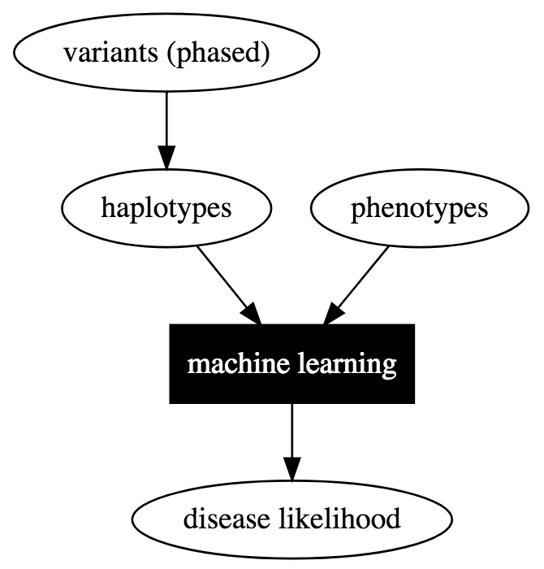

# Cancer haplotype pipeline

Using machine learning to align individual genome and population variant graphs.

* Call haplotypes from phased genotype data
* Combine phenotypes and haplotypes to predict disease likelihood

  
